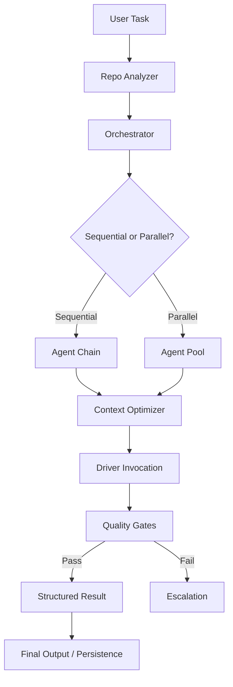

# Agent Swarm: Institutional-Grade Orchestration

An enterprise-ready Python framework for structured agent role configuration, dynamic role discovery, and a stateless orchestration engine. Optimized for Claude Code, Codex, and Gemini.

---

## 🏗️ New Institutional Structure

Following a comprehensive architectural review, this repository has been reorganized into a **`src/` layout** to ensure package integrity and production readiness.

### Swarm Lifecycle


```text
.
├── src/agent_core/       # Core Stateless Engine & Drivers
├── apps/
│   ├── api/              # FastAPI Runner (Event-Driven)
│   └── dashboard/        # [Planned] Vite/React Visualization UI
├── infra/                # Docker, Compose & Terraform (GCP)
├── agents/               # Role Templates & Specs
├── workflows/            # Multi-agent Playbooks (YAML/Python)
├── tests/                # Institutional Quality Gates
└── pyproject.toml        # Unified Dependency Management (uv-ready)
```

---

## 🚀 Getting Started

### 1. Fast Setup with `uv`
We recommend using [uv](https://github.com/astral-sh/uv) for high-performance dependency management.

```bash
uv pip install -e .
```

### 2. Live Observability (Arize Phoenix)
The swarm now supports full OpenTelemetry tracing. See exactly what your agents are thinking.

```bash
cd infra
docker-compose up -d
# Open http://localhost:6006 to see agent traces
```

### 3. Running the API
```bash
export PYTHONPATH=$PYTHONPATH:$(pwd)/src
uvicorn apps.api.main:app --reload
```

---

## 🛡️ Expert Review & Governance
This framework adheres to strict architectural standards:
- **Statelessness**: No implicit memory; all state is explicit in `SwarmContext`.
- **Typing**: Pydantic V2 enforced data contracts across all boundaries.
- **Traceability**: Unified OTel exporting to standard collector endpoints.

See [review_report.md](docs/review_report.md) for the full architectural depth-review.

---

## 🛠️ Development

### Testing
```bash
pytest tests/
```

### Infrastructure (GCP)
```bash
cd infra
terraform init
terraform plan
```

---

## 📄 License

This project is licensed under the MIT License - see the [LICENSE](LICENSE) file for details.

