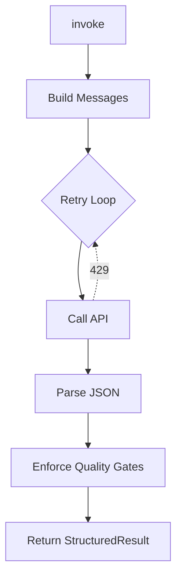

# Driver Development Guide

**Agent Swarm** uses a provider-agnostic driver architecture. All platform-specific logic is isolated within concrete implementations of the `BaseAgentDriver`.

## Architectural Contract

All drivers must adhere to the following invariants:

1.  **Subclass `BaseAgentDriver`**: Inherit from `agent_core.drivers.base.BaseAgentDriver`.
2.  **Statelessness**: Drivers receive a `SwarmContext` and return a `StructuredResult`. No state is stored between invocations.
3.  **Encapsulated Retries**: Drivers handle their own transient failures (e.g., Rate Limits) using the built-in `AsyncRetrying` logic.
4.  **JSON-Only Output**: Drivers must enforce that the model returns valid JSON conforming to the `StructuredResult` schema.

## Implementation Blueprint

To add a new platform (e.g., "Mistral" or "Bedrock"), you must implement three private methods:

### 1. `_build_messages(context)`
Translates the agnostic `SwarmContext` into the platform's specific message format (e.g., list of roles and content).

### 2. `_call_api(messages, context)`
The async method that performs the actual HTTP request. This method is responsible for raising `RateLimitError` on 429s to trigger the framework's exponential backoff.

### 3. `_parse_response(raw, context)`
Parses the raw string output from the model into a Pydantic `StructuredResult` object. Use the helper `_parse_json_result()` for standard JSON-fenced responses.

---

## The `invoke()` Pipeline

The `@final` `invoke()` method in the base class defines a strictly enforced execution sequence that cannot be overridden:

### Safety: The Quality Gate Evaluator
The driver automatically executes quality gates defined in the `AgentSpec`. For security, these are evaluated using a **pure AST interpreter**. There is **ZERO usage of `eval()`** in the driver pipeline, preventing prompt-injection code execution.

---

## Error Handling

| Exception | Usage |
| :--- | :--- |
| `RateLimitError` | Triggers exponential backoff and retry. |
| `MalformedResponseError` | Raised when JSON parsing or schema validation fails. |
| `DriverError` | Base class for all other unrecoverable platform errors. |
